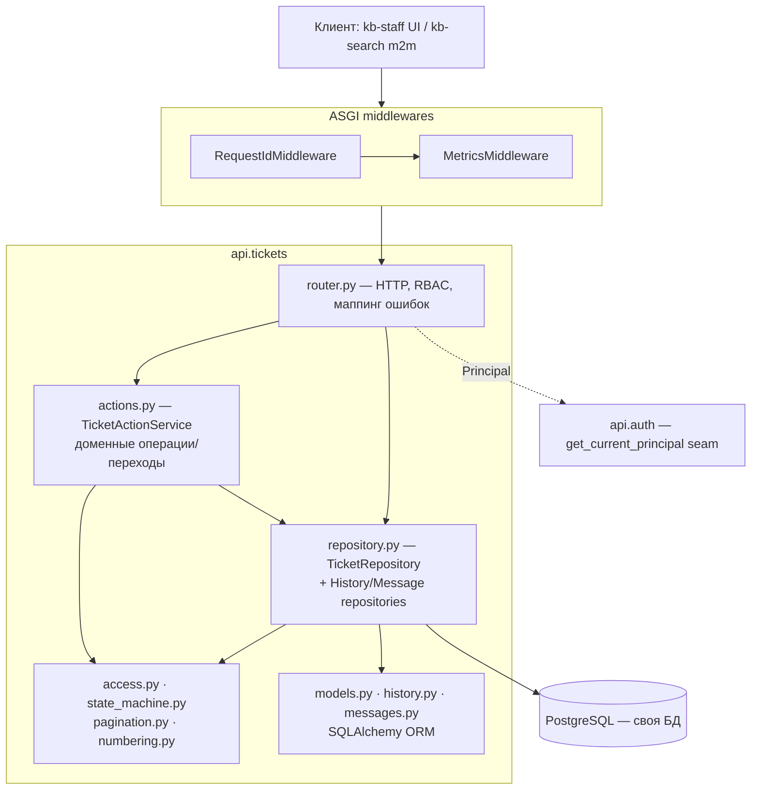
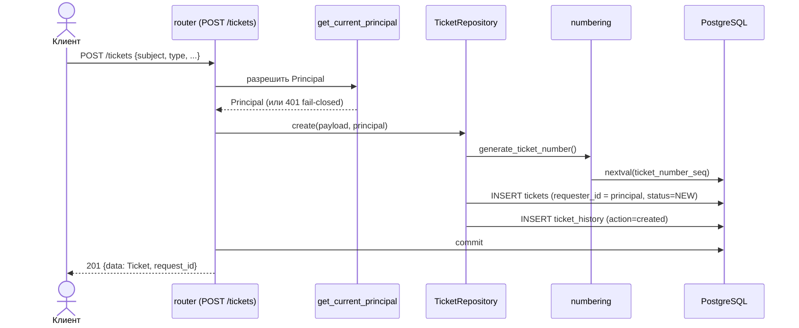
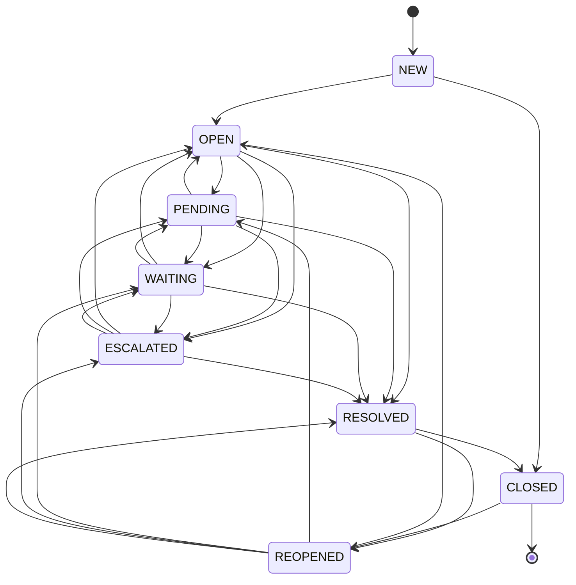
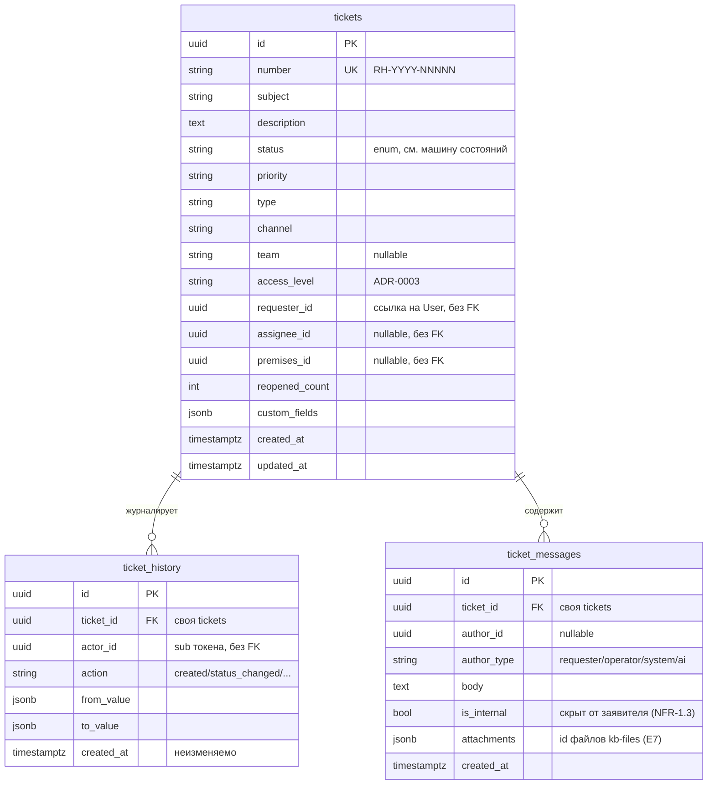

# Architecture overview — kb-support

> Состояние: **E1 «Ядро заявок» реализован** (PR #5–#13, ~99% покрытие). Этот
> документ описывает фактическую архитектуру модуля после E1. Целевое полное ТЗ —
> `handoff/01_postanovka/01_TZ_kb_support_v2.2.md`.

kb-support — самостоятельный микросервис службы поддержки (FastAPI + PostgreSQL).
Связь с rehome-kb-platform и платформой rehome.one — **только по сети, по API**
(арх-константа, см. ниже).

## Слои

Запрос проходит сверху вниз; контроль доступа применяется на уровне хранилища.

- **router** (`api/tickets/router.py`) — эндпоинты, разрешение `Principal`, RBAC
  (403), видимость → 404, маппинг доменных ошибок в RFC 7807 (`api/errors.py`).
- **service** (`api/tickets/actions.py`) — короткие action-операции (assign/
  escalate/resolve/close/reopen/rate): переход статуса через машину состояний +
  запись в журнал.
- **repository** (`api/tickets/repository.py`, `history.py`, `messages.py`) —
  доступ к данным; **storage-level фильтры доступа** (NFR-1.2/1.3) строятся в SQL.
- **support-модули** — `access.py` (фильтр видимости), `state_machine.py`
  (разрешённые переходы), `pagination.py` (keyset-курсор), `numbering.py`
  (`RH-YYYY-NNNNN`).
- **models** — ORM-сущности (`Ticket`, `TicketHistory`, `TicketMessage`).

## Реализованные компоненты (E1)

| Компонент | Файл | Ответственность |
|---|---|---|
| `Ticket` | `api/tickets/models.py` | Центральная сущность (§3.1); ссылки на платформу — UUID **без FK** |
| `TicketHistory` | `api/tickets/history.py` | Неизменяемый журнал действий (§3.7, NFR-1.4); `record_changes` diff |
| `TicketMessage` | `api/tickets/messages.py` | Переписка; `is_internal` скрыт от заявителя (NFR-1.3) |
| Доменные enum | `api/tickets/enums.py` | Status/Priority/Type/Channel/Team/AccessLevel/AuthorType |
| Схемы API | `api/tickets/schemas.py` | Pydantic create/read/update/summary/envelopes/action-inputs |
| `TicketRepository` | `api/tickets/repository.py` | create / get_for_principal / list_tickets / apply_update |
| Видимость | `api/tickets/access.py` | `visibility_filter` (NFR-1.2, SQL-уровень) |
| Машина состояний | `api/tickets/state_machine.py` | `ALLOWED_TRANSITIONS`, `is_allowed_transition` |
| Actions | `api/tickets/actions.py` | `TicketActionService` (6 операций) |
| Пагинация | `api/tickets/pagination.py` | keyset cursor + sort (priority-rank, nullable handling) |
| Нумерация | `api/tickets/numbering.py` | `RH-YYYY-NNNNN` через PG-sequence |
| Auth seam | `api/auth/` | `Principal` + `get_current_principal` (реальная валидация — #29) |
| Ошибки | `api/errors.py` | RFC 7807 problem+json |
| Observability | `api/observability/` | JSON-логи + mask_pii (NFR-1.5), request_id, метрики, readyz |

### HTTP API (E1)

`POST /api/v1/support/tickets` · `GET /…/tickets` (cursor-пагинация+фильтры) ·
`GET /…/tickets/{id}` · `PATCH /…/tickets/{id}` · `GET /…/tickets/{id}/history`
(внутренний) · `GET|POST /…/tickets/{id}/messages` · `POST /…/tickets/{id}/{assign,
escalate,resolve,close,reopen,rate}` · `/healthz` · `/readyz` · `/metrics`.

Контракт — `docs/openapi.yaml` (3.1-strict, #11), проверяется контрактными
тестами `backend/tests/contract/` (drift-детекция, #4).

## Поток создания заявки

`requester_id` берётся из принципала (заявитель не может подменить через payload);
оператор может создать от имени заявителя. Каждое создание пишет первую строку
журнала.

## Машина состояний статусов

Запрещённый переход → 422 (PATCH) / 409 (actions); каждый переход пишется в журнал.

Lifecycle-эффекты: `→REOPENED` инкрементит `reopened_count`; `→RESOLVED`/`→CLOSED`
ставят `resolved_at`/`closed_at`.

## Схема БД (ядро E1)

FK существуют только **внутри** сервиса (`ticket_history`/`ticket_messages` →
`tickets`). Ссылки на сущности платформы (User/Premises/Booking/...) — обычные
UUID без FK (§3.10, арх-константа). Sequence `ticket_number_seq` — источник `number`.

## Ключевые инварианты

- **NFR-1.2** — фильтр доступа на уровне хранилища (`visibility_filter`): заявитель
  видит только свои заявки, оператор — заявки своих команд; недоступная → 404.
- **NFR-1.3** — внутренние заметки (`is_internal=true`) исключаются для заявителя
  на уровне SQL; POST internal — только оператору.
- **NFR-1.4** — журнал неизменяем (нет UPDATE/DELETE); retention 1825 дней.
- **NFR-1.5** — маскирование ПДн в логах (`mask_pii`).
- **Anti-spoofing** — `requester_id`/`actor_id`/`author_*` выводятся из принципала,
  не из payload.

## Архитектурная константа

См. `CLAUDE.md` раздел «Архитектурная константа». kb-support — отдельный сервис.
Никаких shared таблиц / shared кода с rehome-kb-platform. Связь — только HTTP API.

### AT-001 — автоматическая проверка (CI)

Enforce'ится через `scripts/check-arch-constraint.sh` + CI job `arch-constraint`.
Скрипт грепит запрещённые паттерны:

- Python imports: `from (rehome_kb_platform|kb_platform|kb_search|kb_wiki|kb_vault|kb_files|kb_auth|kb_staff|kb_hr|kb_eval|kb_infra)`.
- TypeScript imports: то же с dash-separated именами в кавычках.
- SQL: `(FROM|JOIN|UPDATE|INTO|TABLE) (users|premises|bookings|collaborators|service_orders|kb_articles|kb_chat_sessions|kb_documents)`.

Allowlist (для редких legitimate edge cases) — inline `# arch-allow: <reason ≥10 chars>`.
Скрипт сам покрыт unit-тестами в `tests/arch-constraint/`. Локально: `make arch-check`.

## Ссылки

- Контракт API: `docs/openapi.yaml` (production, 3.1-strict) · handoff `docs/handoff/01_postanovka/04_openapi.yaml` (immutable).
- ТЗ: `docs/handoff/01_postanovka/01_TZ_kb_support_v2.2.md` (§3 модель данных, §4 FR, §5/NFR).
- ADR: `docs/adr/0005-support-module.md` (главный), 0003 (контуры доступа).
- Состояние кода: `docs/state-of-code.md` (секция CS.1 — итог E1).
- Процесс: `CLAUDE.md` (Developer) · `CLAUDE-REVIEWER.md` (Reviewer).

## Не реализовано в E1 (следующие этапы)

- **worker/** (Dramatiq) — SLA-таймеры (E4), IMAP-парсер (E7), time-based правила (E5).
- **api/clients/** — HTTP-клиенты к external API (E3): rehome.one, kb-search, kb-wiki,
  kb-files, kb-auth, BankProvider, Insurer webhook.
- **frontend/** — Next.js рабочее место оператора (E2).
- Реальная валидация Keycloak JWT (#29, до E2); claims-типы (E10).
